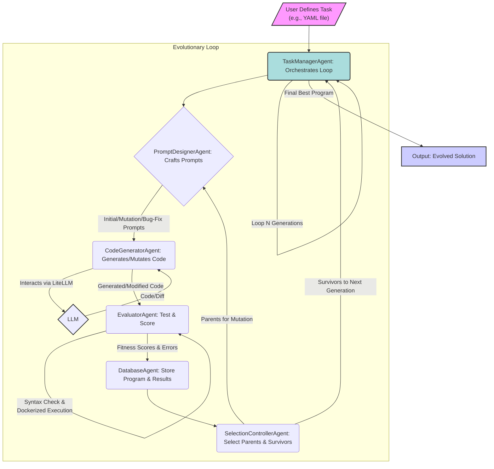

# OpenAlpha_Evolve: Evolve Code with AI - An Open Source Framework


OpenAlpha_Evolve is an open-source Python framework inspired by the groundbreaking research on autonomous coding agents like DeepMind's AlphaEvolve. It's a **regeneration** of the core idea: an intelligent system that iteratively writes, tests, and improves code using Large Language Models (LLMs) via LiteLLM, guided by the principles of evolution.

Our mission is to provide an accessible, understandable, and extensible platform for researchers, developers, and enthusiasts to explore the fascinating intersection of AI, code generation, and automated problem-solving.

[](LICENSE.md)

## Table of Contents
- [✨ The Vision: AI-Driven Algorithmic Innovation](#-the-vision-ai-driven-algorithmic-innovation)
- [🧠 How It Works: The Evolutionary Cycle](#-how-it-works-the-evolutionary-cycle)
- [🚀 Key Features](#-key-features)
- [📂 Project Structure](#-project-structure)
- [🏁 Getting Started](#-getting-started)
- [💡 Defining Your Own Algorithmic Quests!](#-defining-your-own-algorithmic-quests)
- [🔮 The Horizon: Future Evolution](#-the-horizon-future-evolution)
- [🤝 Join the Evolution: Contributing](#-join-the-evolution-contributing)
- [📜 License](#-license)
- [🙏 Homage](#-homage)

---
<!-- Consider adding a more dynamic GIF or a short video here showcasing the process if possible -->
 


## ✨ The Vision: AI-Driven Algorithmic Innovation

Imagine an agent that can:

*   Understand a complex problem description.
*   Generate initial algorithmic solutions.
*   Rigorously test its own code.
*   Learn from failures and successes.
*   Evolve increasingly sophisticated and efficient algorithms over time.

OpenAlpha_Evolve is a step towards this vision. It's not just about generating code; it's about creating a system that *discovers* and *refines* solutions autonomously.

---

<!-- This image is good, ensure it's high-resolution and clearly captioned if possible -->

## 🧠 How It Works: The Evolutionary Cycle

OpenAlpha_Evolve employs a modular, agent-based architecture to orchestrate an evolutionary process. Here's a visual overview of the cycle:



**The Core Agents in the Cycle:**

1.  **Task Definition**: You, the user, define the algorithmic "quest" – the problem to be solved, including examples of inputs and expected outputs.
2.  **`TaskManagerAgent` (Orchestrator)**: The maestro of the operation, coordinating all other agents and managing the overall evolutionary loop.
3.  **`PromptDesignerAgent` (Prompt Engineer)**: This agent crafts intelligent prompts for the LLM. It designs:
    *   *Initial Prompts*: To generate the first set of candidate solutions.
    *   *Mutation Prompts*: To introduce variations and improvements to existing solutions, often requesting changes in a "diff" format.
    *   *Bug-Fix Prompts*: To guide the LLM in correcting errors from previous attempts, also typically expecting a "diff".
4.  **`CodeGeneratorAgent` (Code Synthesizer)**: Powered by an LLM (interfaced via LiteLLM), this agent takes the prompts and generates Python code. If a "diff" is requested and received, it attempts to apply the changes to the parent code.
5.  **`EvaluatorAgent` (Quality Assurance)**: The generated code is put to the test!
    *   *Syntax Check*: Is the code valid Python?
    *   *Execution*: The code is run in a temporary, isolated Docker container against the input/output examples defined in the task.
    *   *Fitness Scoring*: Programs are scored based on correctness (how many test cases pass), efficiency (runtime), and other potential metrics.
6.  **`DatabaseAgent` (Archivist)**: All programs (code, fitness scores, generation, lineage) are stored, creating a record of the evolutionary history (currently in-memory, but designed for extension).
7.  **`SelectionControllerAgent` (Evolutionary Strategist)**: The "survival of the fittest" principle in action. This agent selects:
    *   *Parents*: Promising programs from the current generation to produce offspring.
    *   *Survivors*: The best programs from both the current population and new offspring to advance to the next generation.
8.  **Iteration**: This cycle repeats for a defined number of generations, with each new generation aiming to produce better solutions than the last, ultimately yielding an evolved solution.


---

## 🚀 Key Features

*   **AI-Powered Code Evolution**: Utilizes Large Language Models (via LiteLLM for provider flexibility) not just for generation, but for iterative refinement and bug-fixing through an evolutionary loop. *(Consider an icon representing AI + Evolution)*
*   **Modular Agent System**: A highly extensible architecture. Each component (LLM interaction, evaluation, selection) is an independent agent, making it easy to customize or swap out parts. *(Consider an icon representing modularity/plugins)*
*   **Robust Program Evaluation**: Features automated syntax checks and sandboxed execution in Docker containers, complete with timeouts and resource management for safe evaluation of novel code. *(Consider an icon representing testing/shield)*
*   **Diff-Based Mutations & Fixes**: Intelligently guides LLMs to make targeted changes to existing code using diffs, leading to more efficient exploration than full code regeneration. *(Consider an icon representing code diffs/precision)*
*   **Flexible Task Definition**: Define new algorithmic challenges easily using YAML files, specifying problem descriptions, function signatures, and test cases (including custom validation logic).
*   **Comprehensive Configuration & Logging**: Fine-tune every aspect of the evolutionary process via `config/settings.py` and `.env`. Detailed logs provide full transparency.
*   **Open Source & Community-Driven**: Built with Python, designed for collaboration, experimentation, and collective improvement. Your contributions are welcome!

---

## �� Project Structure

```text
./
├── agents/                  # Contains the core intelligent agents responsible for different parts of the evolutionary process. Each agent is in its own subdirectory.
│   ├── code_generator/      # Agent responsible for generating code using LLMs.
│   ├── database_agent/      # Agent for managing the storage and retrieval of programs and their metadata.
│   ├── evaluator_agent/     # Agent that evaluates the generated code for syntax, execution, and fitness.
│   ├── prompt_designer/     # Agent that crafts prompts for the LLM for initial generation, mutation, and bug fixing.
│   ├── selection_controller/  # Agent that implements the selection strategy for parent and survivor programs.
│   ├── task_manager/        # Agent that orchestrates the overall evolutionary loop and coordinates other agents.
│   ├── rl_finetuner/        # Placeholder for a future Reinforcement Learning Fine-Tuner agent to optimize prompts.
│   └── monitoring_agent/    # Placeholder for a future Monitoring Agent to track and visualize the process.
├── config/                  # Holds configuration files, primarily `settings.py` for system parameters and API keys.
├── core/                    # Defines core data structures and interfaces, like `Program` and `TaskDefinition`.
├── utils/                   # Contains utility functions and helper classes used across the project (currently minimal).
├── tests/                   # Includes unit and integration tests to ensure code quality and correctness (placeholders, to be expanded).
├── scripts/                 # Stores helper scripts for various tasks, such as generating diagrams or reports.
├── main.py                  # The main entry point to run the OpenAlpha_Evolve system and start an evolutionary run.
├── requirements.txt         # Lists all Python package dependencies required to run the project.
├── .env.example             # An example file showing the environment variables needed, such as API keys. Copy this to `.env` and fill in your values.
├── .gitignore               # Specifies intentionally untracked files that Git should ignore (e.g., `.env`, `__pycache__/`).
├── LICENSE.md               # Contains the full text of the MIT License under which the project is distributed.
└── README.md                # This file! Provides an overview of the project, setup instructions, and documentation.
```

---

## 🏁 Getting Started

1.  **Prerequisites**:
    *   Python 3.10+
    *   `pip` for package management
    *   `git` for cloning
    *   **Docker**: For sandboxed code evaluation. Ensure Docker Desktop (Windows/Mac) or Docker Engine (Linux) is installed and running. Visit [docker.com](https://www.docker.com/get-started) for installation instructions.

2.  **Clone the Repository**:
    ```bash
    git clone https://github.com/shyamsaktawat/OpenAlpha_Evolve.git
    cd OpenAlpha_Evolve
    ```

3.  **Set Up a Virtual Environment** (recommended):
    ```bash
    python -m venv venv
    source venv/bin/activate  # On Windows: venv\Scripts\activate
    ```

4.  **Install Dependencies**:
    ```bash
    pip install -r requirements.txt
    ```

5.  **Set Up Environment Variables (Crucial for API Keys)**:
    *   **This step is essential for the application to function correctly with your API keys.** The `.env` file stores your sensitive credentials and configuration, overriding the default placeholders in `config/settings.py`.
    *   Create your personal environment file by copying the example:
        ```bash
        cp .env_example .env
        ```


### LLM Configuration


8.  **Run OpenAlpha_Evolve!**
    Run the example task (Dijkstra's algorithm) with:
    ```bash
    python -m main examples/shortest_path.yaml
    ```
    Watch the logs in your terminal to see the evolutionary process unfold! Log files are also saved to `alpha_evolve.log` (by default).

8.  **Launch the Gradio Web Interface**
    Interact with the system via the web UI. To start the Gradio app:
    ```bash
    python app.py
    ```
    Gradio will display a local URL (e.g., http://127.0.0.1:7860) and a public share link if enabled. Open this in your browser to define custom tasks and run the evolution process interactively.

---

## 💡 Defining Your Own Algorithmic Quests!

Want to challenge OpenAlpha_Evolve with a new problem? It's easy! You can define your tasks in two ways:

### 1. Using YAML Files (Recommended)

Create a YAML file in the `examples` directory with the following structure:

```yaml
task_id: "your_task_id"
task_description: |
  Your detailed problem description here.
  Be specific about function names, expected behavior, and constraints.
function_name: "your_function_name"
allowed_imports: ["module1", "module2"]

tests:
  - description: "Test group description"
    name: "Test group name"
    test_cases:
        input: [arg1, arg2]  # List of arguments
        output: expected_output  # Expected result
        # Use either output or validation_func.
        input: [arg1, arg2]
        validation_func: |
          def validate(output):
              # Custom validation logic
              return condition
```

See the example in examples/shortest_path.yaml

### Included Examples

OpenAlpha_Evolve comes with a couple of pre-defined examples in the `examples/` directory to get you started:

1.  **Shortest Path (Dijkstra's Algorithm)** - `examples/shortest_path.yaml`
    *   **Goal**: Evolve a Python function `find_shortest_path(graph, start_node, end_node)` that implements Dijkstra's algorithm or a similar shortest path algorithm.
    *   **Input**: An adjacency list representation of a graph, a starting node, and an ending node.
    *   **Output**: A list of nodes representing the shortest path from start to end, and the total distance of that path.
    *   **Diagram/Concept**: 
        *(Replace this text block with an actual image of a sample graph, e.g., a PNG showing nodes and weighted edges, and highlight an example shortest path.)*
        ```
        (A) --1-- (B) --2-- (C)
         | \       |       / |
         4  `----(D)--3--'   5
         |         |         |
         `--------(E)--------' 
        
        Task: Find shortest path from A to C.
        Example (visual): A graph with nodes A,B,C,D,E. Edges (A,B,1), (A,D,4), (A,E,7), (B,C,2), (B,D,3), (D,E,1), (E,C,5). Shortest path A->B->C (cost 3).
        ```

2.  **Circle Packing** - `examples/circle_packing.yaml`
    *   **Goal**: Evolve a Python function `pack_circles(num_circles)` that attempts to pack a given number of circles into a unit square (1.0x1.0) such that the sum of their radii is maximized.
    *   **Input**: The number of circles to pack.
    *   **Output**: A list of `(center_x, center_y, radius)` tuples for each circle, and the total sum of the radii.
    *   **Constraints**: Circles must be within the unit square and must not overlap.
    *   **Diagram/Concept**:
        *(Replace this text block with an actual image showing a few circles of varying sizes packed efficiently within a square boundary.)*
        ```
        +-----------------+
        |  .--.           |
        | (    ) o        |
        |  `--'  .--.     |
        |   .--. (  )     |
        |  (    ) `--'    |
        |   `--'          |
        +-----------------+
        Task: Maximize sum of radii of non-overlapping circles in the square.
        Example (visual): A square containing 3-4 circles of different sizes, touching each other and the boundaries, but not overlapping.
        ```

### 2. Using Python Code (Legacy)

You can still define tasks programmatically using the `TaskDefinition` class:

```python
from core.task_definition import TaskDefinition

task = TaskDefinition(
    id="your_task_id",
    description="Your detailed problem description",
    function_name_to_evolve="your_function_name",
    input_output_examples=[
        {"input": [arg1, arg2], "output": expected_output},
        # More examples...
    ],
    allowed_imports=["module1", "module2"]
)
```

### Best Practices for Task Definition

Crafting effective task definitions is key to guiding OpenAlpha_Evolve successfully. Consider these tips:

*   **Be Clear and Unambiguous**: Write task descriptions as if you're explaining the problem to another developer. Avoid jargon where possible, or explain it clearly.
*   **Provide Diverse and Comprehensive Examples**: Your test cases are the primary way the agent verifies its generated code.
    *   Include typical use cases
    *   Cover edge cases (empty inputs, boundary values, etc.)
    *   Include examples that test different logical paths
    *   Use validation functions for complex checks
*   **Start Simple, Then Increase Complexity**: Break down complex problems into simpler versions first.
*   **Specify Constraints and Edge Cases**: Mention specific constraints and edge cases in the description.
*   **Define Expected Function Signature**: Clearly state the expected function name and parameters.
*   **Iterate and Refine**: Review and refine your task definition based on the agent's performance.

---

## 🔮 The Horizon: Future Evolution

OpenAlpha_Evolve is a foundational framework with exciting possibilities for growth. Here are some directions we envision or are actively exploring:

*   **Advanced Prompt Engineering**: Implementing techniques for the system to self-optimize its prompts (meta-prompts) or adapt them dynamically based on performance.
*   **Sophisticated Genetic Operators**: Beyond basic mutation, exploring more complex crossover techniques tailored for code, or LLM-driven "insightful" mutations that refactor or redesign parts of the algorithm.
*   **Multi-Objective Optimization**: Evolving solutions that balance multiple fitness criteria simultaneously (e.g., correctness, runtime, memory usage, code simplicity).
*   **Reinforcement Learning for Hyperparameter Tuning**: Using RL to optimize the parameters of the evolutionary algorithm itself.
*   **Integration with Formal Verification**: Exploring pathways to not just test code, but to formally prove properties of the evolved algorithms.
*   **Broader Language Support**: Extending the framework to evolve code in languages beyond Python.
*   **Enhanced Monitoring & Visualization**: Developing a more comprehensive dashboard (perhaps expanding the Gradio UI or using other tools) to visualize the evolutionary process, fitness landscapes, and program lineage.
*   **Community-Driven Task & Solution Library**: Building a repository where users can share task definitions and successful evolved solutions.
*   **Human-in-the-Loop Enhancements**: More sophisticated ways for users to guide the evolutionary search, provide feedback, or inject domain knowledge.

We believe the journey of AI-driven code evolution is just beginning, and we're excited to see where the community takes this project!

---

## 🤝 Join the Evolution: Contributing

This is an open invitation to collaborate! Whether you're an AI researcher, a Python developer, or simply an enthusiast, your contributions are welcome.

*   **Report Bugs**: Find an issue? Please create an issue on GitHub!
*   **Suggest Features**: Have an idea to make OpenAlpha_Evolve better? Open an issue to discuss it!
*   **Submit Pull Requests**:
    *   Fork the repository.
    *   Create a new branch for your feature or bugfix (`git checkout -b feature/your-feature-name`).
    *   Write clean, well-documented code.
    *   Add tests for your changes if applicable.
    *   Ensure your changes don't break existing functionality.
    *   Submit a pull request with a clear description of your changes!

Let's evolve this agent together!

---

## 📜 License

This project is licensed under the **MIT License**. See the `LICENSE.md` file for details.

---

## 🙏 Homage

OpenAlpha_Evolve is proudly inspired by the pioneering work of the Google DeepMind team on AlphaEvolve and other related research in LLM-driven code generation and automated discovery. This project aims to make the core concepts more accessible for broader experimentation and learning. We stand on the shoulders of giants.

---

*Disclaimer: This is an experimental project. Generated code may not always be optimal, correct, or secure. Always review and test code thoroughly, especially before using it in production environments.* 
